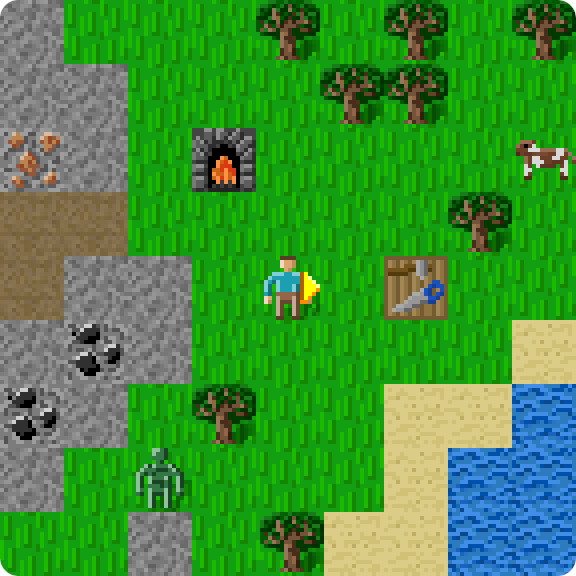
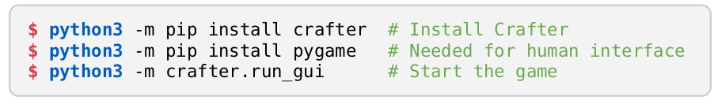

BENCHMARKING THE SPECTRUM
OF AGENT CAPABILITIES

Danijar Hafner
Google Research, Brain Team
University of Toronto
mail@danijar.com

ABSTRACT

Evaluating the general abilities of intelligent agents requires complex simulation
environments. Existing benchmarks typically evaluate only one narrow task per
environment, requiring researchers to perform expensive training runs on many
different environments. We introduce Crafter, an open world survival game with
visual inputs that evaluates a wide range of general abilities within a single
environment. Agents either learn from the provided reward signal or through
intrinsic objectives and are evaluated by semantically meaningful achievements that
can be unlocked during each episode, such as discovering resources and crafting
tools. Consistently unlocking all achievements requires strong generalization, deep
exploration, and long-term reasoning. We experimentally verify that Crafter is
of appropriate difficulty to drive future research and provide baselines scores of
reward agents and unsupervised agents. Furthermore, we observe sophisticated
behaviors emerging from maximizing the reward signal, such as building tunnel
systems, bridges, houses, and plantations. We hope that Crafter will accelerate
research progress by quickly evaluating a wide spectrum of abilities.

INTRODUCTION

Crafter is an open world survival game for reinforcement
learning research. Shown in Figure 1, Crafter features
randomly generated 2D worlds with forests, lakes, moun-
tains, and caves. The player needs to forage for food and
water, find shelter to sleep, defend against monsters, col-
lect materials, and build tools. The game mechanics are
inspired by the popular game Minecraft and were simpli-
fied and optimized for research productivity. Crafter aims
to be a fruitful benchmark for reinforcement learning by
focusing on the following design goals:

Research challenges Crafter poses substantial chal-
lenges to current methods. Procedural generation requires
strong generalization, the technology tree evaluates wide
and deep exploration, image observations calls for repre-
sentation learning, repeated subtasks and sparse rewards
evaluate long-term reasoning and credit assignment.

Meaningful evaluation Agents are evaluated by a
range of achievements that can be unlocked in each
episode. The achievements correspond to meaningful
milestones in behavior, offering insights into ability spec-
trum of both reward agents and unsupervised agents.

Iteration speed Crafter evaluates many agent abilities
within a single environment, vastly reducing the compu-
tational requirements over benchmarks suites that require
training on many separate environments from scratch,
while making it more likely that the measured perfor-
mance is representative of new domains.



**Figure 1:** Agent view of a procedurally generated world in Crafter, showing terrain types, resources, and creatures. Agents learn from image inputs and aim to unlock a range of semantically meaningful achievements during each episode. The achievements evaluate strong generalization, wide and deep exploration, and long-term reasoning.

```bash
python3 -m pip install crafter # Install Crafter
python3 -m pip install pygame   # Needed for human interface
python3 -m crafter.run_gui      # Start the game
```



**Figure 2:** Play Crafter yourself through the human interface.

2 RELATED WORK

Benchmarks have been a driving force behind the progress and successes of reinforcement learning
as a field (Bellemare et al., 2013; Brockman et al., 2016; Kempka et al., 2016; Beattie et al., 2016;
Tassa et al., 2018; Juliani et al., 2018). Benchmarks often require a large amount of computational
resources and yet only test a small fraction of the abilities that a general agent should master (Cobbe
et al., 2020). This section directly compares Crafter to four particularly related benchmarks.

Minecraft Crafter is inspired by the successful 3D video game Minecraft, which is available to
researchers via Malmo (Johnson et al., 2016) and MineRL (Guss et al., 2019). Minecraft features
diverse open worlds with randomly generated and modifiable terrain, as well as many different
resources, tools, and monsters. However, Minecraft is too complex to be solved by current methods
(Milani et al., 2020), it is unclear by what metric agents should be evaluated by, the environment
is slow, and can be difficult to use because it requires Java and a window server. In comparison,
Crafter captures many principles of Minecraft in a simple and fast environment, where results can
be obtained in a matter of hours, and where a large number of semantically meaningful evaluation
metrics are available for reinforcement learning with or without extrinsic reward. The goal of Crafter
is not to replace Minecraft but progress faster towards it.

Atari The Atari Learning Environment (Bellemare et al., 2013) has been the gold standard bench-
mark in reinforcement learning. It comprises around 54 individual games, depending on the evaluation
protocol (Mnih et al., 2015; Schulman et al., 2017; Badia et al., 2020; Hafner et al., 2020). While the
large number of games tests different abilities of agents, they require a large amount of computation.
The recommended protocol of training the agent with 5 random seeds on each game for 200M steps
requires over 2000 GPU days (Castro et al., 2018; Hessel et al., 2018). This substantially slows down
experimentation and makes the complete benchmark infeasible for most academic labs. Moreover,
Atari games are nearly deterministic, so agents can approximately memorize their action sequences
and are not required to generalize to new situations (Machado et al., 2018).

ProcGen ProcGen (Cobbe et al., 2020) provides a benchmark that is similar to Atari but explicitly
addresses the determinism present in Atari through the use of procedural generation and randomized
textures. It consists of 16 games, where each episode features a randomly generated level layout.
Similarly, Crafter relies on procedural generation to provide a different world map with different
distribution of resources and monsters for every episode. However, ProcGen still requires training
methods on 16 individual games for 200M environment steps, which each focus on a narrow aspect
of an agent’s general abilities. In comparison, Crafter evaluates many different abilities of an agent
by training only on a single environment for 5M steps, substantially accelerating experimentation.

NetHack NetHack (Küttler et al., 2020) is a text-based game, where the player traverses a randomly
generated system of dungeons with many different items and creatures. Unlike the other discussed
environments, NetHack uses symbolic inputs and thus does not evaluate an agent’s ability to learn
representations of high-dimensional inputs. The game is challenging due to the large amount
of knowledge required about the many different items and their effects, even for human players.
As a result, NetHack requires many environment steps for agents to acquire this domain-specific
knowledge; 1B steps were used in the original paper. In contrast, Crafter generates diverse complex
worlds from simple underlying rules, focusing more on generalization than memorization of facts.

3 CRAFTER BENCHMARK

We introduce Crafter, a benchmark that evaluates a variety of agent abilities in a single environment.
This section describes the game mechanics of the environment, the interface of agent inputs and
actions, the evaluation protocol that is based on a range of semantically meaningful achievements,
and the open challenges that Crafter poses for future research.




**Figure 3:** Crafter procedurally generates a unique world for every episode that features several terrain types: grasslands, forests, lakes, mountains, caves. Memorizing action sequences is thus not a viable strategy and agents are forced to learn behaviors that generalize to new situations.

3.1 GAME MECHANICS

This section describes the game mechanics of Crafter, namely its randomly generated world maps,
the levels of health and other internal quantities that the player has to maintain, the resources it
can collect and objects and tools it can make from them, as well as the creatures and how they are
influenced by the time of day. The images of all materials and objects are shown in Figure E.1. All
randomness in the environment is uniquely determined by an integer seed that is derived from the
initial seed passed to the environment and the episode number.

Terrain generation A unique world is generated for every episode, shown in Figure 3. The world
leverages an underlying grid of 64 × 64 cells but the agent only observes the world through pixel
images. The terrain features grasslands, lakes, and mountains. Lakes can have shores, grasslands can
have forests, and mountains can have caves, ores, and lava. These are determined by OpenSimplex
noise (Spencer, 2014), a form of locally smooth noise. Within the areas determined by noise, objects
appear with equal probability at any location, such as trees in forests and skeletons in caves.

Health and survival The player has levels of health, food, water, and rest that it must prevent from
reaching zero. The levels for food, water, and rest decrease over time and are restored by drinking
from a lake, chasing cows or growing fruits to eat, and sleeping in places where monsters cannot
attack. Once one of the three levels reaches zero, the player starts losing health points. It can also
lose health points when attacked by monsters. When the health points reach zero, the player dies.
Health points regenerate over time when the player is not hungry, thirsty, or sleepy.

Resources and crafting There are many resources, such as saplings, wood, stone, coal, iron, and
diamonds, the player can collect in its inventory and use to build tools and place objects in the world.
Many of the resources require tools that the place must first build from more basic resources, leading
to a technology tree with several levels. Standing nearby a table enables the player to craft wood
pickaxes and swords, as well as stone pickaxes and stone swords. Crafting a furnace from stone
enables crafting iron pickaxes and iron swords from both iron, coal, and wood.

Creatures and night Creatures are initialized in random locations and move randomly. Zombies
and cows live in grasslands and are automatically spawned and despawned to ensure a given amount
of creatures. At night, the agent’s view is restricted and noisy and a larger number of zombies is
spawned. This makes it difficult to survive without securing a shelter, such as a cave. Skeletons live
in caves and try to keep the player at a distance to shoot arrows at the player. The player can interact
with creatures to decrease their health points. Cows move randomly and offer a food source.

3.2 ENVIRONMENT INTERFACE

This section defines the specification of the environment, explains the available actions, agent inputs,
episode termination, and additional information provided by the environment. The design goal of
these is to make the environment easy to use and inspect. The environment uses the Gym interface
(Brockman et al., 2016) with visual agent inputs and flat categorical actions.



Figure 4: The 22 achievements that can be unlocked within each episode. The arrows indicate which
achievements will be completed along the way of working toward more challenging achievements.
Several of the earlier tasks have to be repeated multiple times, such as collecting resources, to progress further. A reward is only given when an achievement is unlocked for the first time during the episode.


Observations Agent receive color images of size 64 × 64 × 3 as their only inputs. The image
shows a local top-down view of the map, reaching 4 cells west and east and 3 cells north and south of
the player position. Below this view of the world, the image shows the current inventory state of the
player, including its health points, food, water, and rest levels, collected materials, and crafted tools.
The agent needs to learn to read its inventory state out of the image.

Actions The action space is a flat categorical space with 17 actions, represented by integer indices.
The actions allow the player to move in all 4 directions along the grid, interact with the object in front
of it, go to sleep, place objects, and make tools. Each object and tool has a separate action associated
with it. Tools are kept in the inventory whereas objects are automatically placed in front of the player.
If the agent does not hold the required materials for making an object or tool, the action has no effect.

Termination Each episode terminates when the player’s health points reach 0. This can happen
when the player dies out of hunger, thirst, or tiredness, when attacked by a zombie or skeleton, or
when falling into lava. Health points automatically regenerate, as long as the agent is not too hungry,
thirsty, or sleepy. There is no negative reward for dying, as the reward signal already includes a
penalty for losing health points. Episodes also end when reaching the time limit of 10,000 steps.

Additional information The environment allows access to privileged information about the world
state that the agent is forbidden to observe. This includes numeric inventory counts, achievement
counts, the current coordinate of the player on the grid, and a semantic grid representation of the map.
These can be used for debugging purposes or for other research scenarios, such as predicting the
underlying environment state to evaluate representation learning or video prediction models.

3.3 EVALUATION PROTOCOL

To evaluate the diverse abilities of artificial agents on Crafter, we define two benchmarks. The first
benchmark allows agents to access a provided reward signal, while the second benchmark does not
and requires agents to purely learn from intrinsic objectives. Besides access to the provided reward
signal, the evaluation protocols are identical. An agent is granted a budget of 1M environment steps
to interact with the environment. The agent performance is evaluated through success rates of the
individual achievements throughout its training, as well as an aggregated score.

Collect IronCollect DrinkPlace TableMake Wood PickaxeDefeat SkeletonDefeat ZombieCollect WoodCollect StoneCollect CoalMake Stone PickaxeMake Iron PickaxeCollect DiamondPlace FurnaceMake Wood SwordEat CowPlace StoneMake Iron SwordMake Stone SwordPlace PlantCollect SaplingEat PlantWake Up

Achievements To evaluate a wide spectrum of agent abilities, Crafter defines 22 achievements. The
achievements are shown in Figure 4 and correspond to semantically meaningful behaviors, such as
collecting various resources, building objects and tools, finding food and water, defeating monsters,
and waking up safely after sleeping. The achievements cover a wide range of difficulties, making
them suitable to evaluate both weak and strong players and providing continuous feedback throughout
the development process of new methods. Some achievements are independent of each other to test
for breadth of exploration, while others depend on each other to test for deep exploration.

Reward Crafter provides a sparse reward signal that is the sum of two components. The main
component is a reward of +1 every time the agent unlocks each achievement for the first time during
the current episode. The second component is a reward of −0.1 for every health point lost and a
reward of +0.1 for every health point that is regenerated. Because the maximum number of health
points is 9, the second reward component only affects the first decimal of the episode return, and
ceiling the episode return yields the number of achievements unlocked during the episode.

Success rates The success rates offer insights into the breadth of abilities learned by an agent.
The success rates are computed separately for each of the achievements, as the fraction of training
episodes during which the agent has unlocked the achievement at least once. It is computed across all
episodes that lead up to the budget of 1M environment steps, requiring agents to be data-efficient.1
Note that the number of environment steps is fixed but the number of episodes can differ between
agents. Unlocking an achievement more than once per episode does not affect the success rate.

Score The score summarizes the agent abilities into a single number. It is computed by aggregating
the success rates for the individual achievements. Unlocking difficult achievements, even if it happens
rarely, should contribute more than increasing the success rate of achievements that are already
unlocked frequently even further. To account for the range of difficulties of the achievements, we
average the success rates in log-space, known as the geometric mean.2 Unlike the reward, the score
thus takes the achievement’s difficulties into account, without having to know them beforehand.

Discussion Aggregating across tasks via a geometric mean weighs tasks based on their difficulty to
the agent, resulting in higher scores for agents that explore more broadly. For example, collecting a
diamond 1% of the time instead of 0% is a meaningful improvement, whereas collecting wood 95%
of the time instead of 90% is not. This allows distinguishing how broadly agents have explored their
environment even if they achieve similar rewards. The geometric mean also establishes a meaningful
metric for unsupervised agents, which may get bored of tasks after performing them a few times and
then move on to new tasks. A caveat of the geometric mean is that agents with rewards are evaluated
by something they only indirectly optimize for, which can change their ranking order. Increasing
reward and score is generally correlated, but capacity-limited agents may choose to optimize reward
by mastering easy tasks and ignoring hard tasks, which only slowly increases the geometric mean.

3.4 RESEARCH CHALLENGES

Crafter aims to evaluate a diverse range of agent abilities within a single environment. Thus, if a
method performs well on Crafter there should be a high chance that it also handles the challenges
of other environments. The challenges also make Crafter suitable for evaluating progress on open
research questions, such as strong generalization, wide and deep exploration, discovering reusable
skills, and long-term memory and reasoning. Crafter is designed to pose the following challenges:

Exploration Independent achievements evaluate wide exploration, without offering a linear path
for the agent to follow. Dependent achievements evaluate deep exploration of the technology tree.
Collecting a diamond requires an iron pickaxe, which in turn requires a furnace, table, coal, iron, and
wood. The furnace requires collecting stone, which requires building a wood pickaxe at a table.

Generalization Every episode is situated in a unique world that is procedurally generated. More-
over, many aspects of the game reoccur in different contexts, such as creatures and resources that can
be found in different landscapes and times of day. This forces successful agents to recognize similar
situations in different circumstances and be robust to changes in irrelevant details.

1While allowing a large number of environment steps would help agents achieve higher scores more easily, it
would result in a comparison of compute resources rather than algorithm quality.
2The Crafter score of an agent is computed as S
agent’s success rate of achievement i and N = 22 is the number of achievements.

i=1 ln(1 + si)) − 1, where si ∈ [0; 100] is the

.
= exp( 1
N

(cid:80)N



(a) Crafter scores of various agents

(b) Same scores including human experts


**Figure 5:** Crafter Benchmark Scores for various agents with and without rewards. Current top methods achieve scores of up to 10% that are far from the 50% of human experts, posing a substantial challenge for future research. Crafter scores are computed as the geometric mean across achievements of their success rates within the budget of 1M environment steps. Numbers in Table 1.

Reusable skills Advancing in the game requires the agent to repeat several behaviors over long
horizons, such as finding food, defending against monsters, and collecting common materials that are
needed many times. The behavior of a successful agent naturally decomposes into sub-tasks, making
Crafter suitable for studying hierarchical reinforcement learning.

Credit assignment Only sparse rewards are given for unlocking an achievement for the first time
during each episode. Moreover, several achievements require long-term reasoning, such as collecting
the necessary resources for crafting a particular tool or planting saplings that can be harvested many
hundred time steps later. This makes Crafter a challenge for temporal credit assignment.

Memory The agent inputs only show the player’s immediate surroundings, making Crafter partially
observed. To survive for a long time, agents need to remember where to find lakes to drink and open
grasslands to hunt. Moreover, to effectively find rare resources, such as iron and diamonds, the agent
needs to remember what parts of the map it has already searched.

Representation The agent observes its environment via high-dimensional images, from which it
has to extract entities that are meaningful for decision making. Similar to applications in the real
world, the reward signal is sparse and the amount of environment interaction limited. As a result,
successful agents will likely rely on explicit representation learning techniques.

Survival
In previous environments, the player can often survive by doing nothing. This allows for
degenerate solutions to intrinsic objectives, unlike the real world where animals are forced to adapt to
survive and maintain homeostasis and allostasis. In Crafter, the player struggles to survive through
the constant pressure of maintaining enough water, food, rest, and defending against zombies.

Method

Score (%)

Return

Human Experts

50.5±6.8

14.3±2.3

DreamerV2
PPO
Rainbow

10.0±1.2
4.6±0.3
4.3±0.2

Plan2Explore (Unsup) 2.1±0.1
2.0±0.1
RND (Unsup)
1.6±0.0
Random

9.0±1.7
4.2±1.2
5.0±1.3

2.1±1.5
0.7±1.3
2.1±1.3

Table 1: Crafter benchmark scores. The Crafter
score is computed as the geometric mean of suc-
cess rates for all 22 achievements available in the
environment. The score prefers general agents
that unlock a wide range of achievements over
those that unlock a small number of achieve-
ments very frequently. For example, an agent
that explores many different achievements over
the course of training achieves a higher score than
one that only performs same simple tasks over
an over. The score thus establishes a meaningful
metric both for agents with and without reward.

RandomRND(Unsup)Plan2Explore(Unsup)RainbowPPODreamerV2024681012Crafter Score (%)RandomRND(Unsup)Plan2Explore(Unsup)RainbowPPODreamerV2Human Experts020406080100Crafter Score (%)


**Figure 6:** Agent ability spectrum showing the success rates of agents with rewards. These are unlocking percentages for all 22 achievements, computed over all training episodes. Rainbow manages to drink water and forage for food. PPO additionally rarely collects coal and builds stone tools. DreamerV2 achieves these more frequently and additionally sometimes grows and eats fruits. Numbers in Appendix A.

4 EXPERIMENTS

To established baselines for future work, we train various reinforcement learning methods on Crafter
either with and without rewards. The two benchmarks follow the evaluation protocol in Section 3.3,
which grants each agent a budget of 1M environment frames and computes the success rates of the
individual achievements across all training episodes, as well as an aggregate score for the agent.
Furthermore, we analyze the emergent agent behaviors qualitatively and record a dataset of human
expert players to estimate the difficulty of the environment. The environment, code for the baseline
agents and figures in this paper, and the human dataset are available on the project website. 3

4.1 BENCHMARK WITH REWARDS

We provide baselines scores for three reinforcement learning algorithms on Crafter with rewards.
DreamerV2 (Hafner et al., 2020) learns a world model and optimizes a policy through planning in
latent space. We used its default hyper parameters for Atari and increased the model size. PPO
(Schulman et al., 2017) is a popular method that learns to map input images to actions through policy
gradients. We use a convolutional neural network policy with hyper parameters that were tuned for
Atari (Hill et al., 2018). Rainbow (Hessel et al., 2018) is based on Q-Learning and combines several
advances, including for exploration. The defaults for Atari did not work well, so we tuned the hyper
parameters for Crafter and found a compromise between Atari defaults and the data-efficient version
of the method (van Hasselt et al., 2019) to be ideal. All agents trained for 1M environment steps in
under 24 hours on a single GPU and we repeated the training for 10 random seeds per method. The
training reward curves are included in Appendix D.

The scores are listed in Table 1 and visualized in Figure 5. DreamerV2 achieves a score of 10.0%,
followed by PPO with 4.6% and Rainbow of 4.3%. Despite these being top reinforcement learning
methods, they lack behind the score of expert human players of 50.5%, which we describe in further
detail in Section 4.3. We conclude that Crafter is a challenging benchmark, where current methods
make learning progress but future research is needed to achieve high performance. For comparison,
we report the episode returns in Table 1, computed over the episodes within the last 105 environment
steps of training. We find a trend similar to the scores but notice that the methods are harder to tell
apart, because differences on hard tasks that are rarely achieved affect the return less. Moreover,
the scores are more meaningful for unsupervised agents, which should explore many achievements
over time, but not necessarily remain interested in them until the end of training. The success rates
for individual achievements are visualized in Figure 7, which offer insights into the breadth and
depth of agent abilities. Rainbow displays high success rates on easier achievements. PPO learned

3https://danijar.com/crafter

Collect CoalCollect DiamondCollect DrinkCollect IronCollect SaplingCollect StoneCollect WoodDefeat SkeletonDefeat ZombieEat CowEat PlantMake Iron PickaxeMake Iron SwordMake Stone PickaxeMake Stone SwordMake Wood PickaxeMake Wood SwordPlace FurnacePlace PlantPlace StonePlace TableWake Up0.010.1110100Success Rate (%)DreamerV2PPORainbow


**Figure 7:** Agent ability spectrum showing the success rates for Crafter without rewards. Random actions unlock the 6 easiest achievements sometimes, such as drinking water and collecting wood. Plan2Explore forages for food and defeats monsters more frequently, to ensure longer survival. RND additionally collects stones and rarely even collects coal and builds furnaces. Numbers in Appendix B.

to additionally make stone tools and furnaces. DreamerV2 achieved these more frequently and
discovered growing and harvesting plants. None of the agents learned to collect and use iron for tools
or to collect diamonds, or to achieve high success rates on many of the achievements.

4.2 UNSUPERVISED BENCHMARK

We provide baselines scores for two unsupervised reinforcement learning agents on Crafter without
rewards. We also include a baseline that simply chooses random actions. RND (Burda et al., 2018b)
is a popular exploration method that seeks out novel inputs, estimated as the prediction error of
a network that aims to predict fixed random embeddings of the input images. We use its default
parameters for Atari. Plan2Explore (Sekar et al., 2020) learns a world model to plan for the expected
information gain of imagined trajectories, allowing it to directly seek out imagined states that have
not been experienced before. We implement Plan2Explore on top of DreamerV2 and keep the same
hyper parameters. We use a non-episodic value function as RND does, which helps exploration in
episodic environments (Burda et al., 2018b). All agents trained for 1M environment steps in under 24
hours on a single GPU and we repeated the training for 10 random seeds per method.

The scores are listed in Table 1 and in Figure 5. Plan2Explore achieves a score of 2.1%, followed
by RND at 2.0%, both ahead of the random agent at 1.6%. Despite these being top unsupervised
reinforcement learning methods, they lack far behind optimal performance or even the performance
of agents that learn with rewards, posing a substantial challenge for future research. The results are
encouraging, showing that unsupervised objectives by themselves can lead to meaningful behaviors
(Burda et al., 2018a) in Crafter. Inspecting the success rates for individual achievements in Figure 6
confirms that Plan2Explore and RND make progress in exploring the different behaviors compared to
the random agent, including occasionally collecting coal, placing furnaces, and making stone swords,
which are several steps deep into the technology tree.

4.3 EMERGENT BEHAVIORS

To better understand the potential of the environment, we train DreamerV2 for 50M steps and
investigate the behaviors qualitatively. In this amount of time, the agent learns to build stone tools
and even iron tools on individual occurrences. Interestingly, we observe a range of sophisticated
emergent behaviors, such as building tunnel systems, building bridges to cross lakes, and outsmarting
skeletons by dodging arrows, blocking arrows with stones, and digging through walls to surprise
skeletons from the side. Furthermore, DreamerV2 learns to seek shelter to protect itself from the
zombies at night by hiding in caves and even digging its own caves and closing the entrances with
stones. Finally, we find that the agent sometimes manages to build plantations of many saplings,
defends them against monsters, and eats the growing fruits in order to ensure a reliable and steady
food supply. A video of the emergent behaviors is available on the project website.

Collect CoalCollect DiamondCollect DrinkCollect IronCollect SaplingCollect StoneCollect WoodDefeat SkeletonDefeat ZombieEat CowEat PlantMake Iron PickaxeMake Iron SwordMake Stone PickaxeMake Stone SwordMake Wood PickaxeMake Wood SwordPlace FurnacePlace PlantPlace StonePlace TableWake Up0.010.1110100Success Rate (%)Plan2ExploreRNDRandom

4.4 HUMAN EXPERTS DATASET

Crafter includes a graphical user interface that allows humans to play the game via the keyboard and
record the trajectories of the game. The human interface can be installed via the command shown in
Figure 2. Through the human interface, we recorded the games of 5 human experts for a combined
total of 100 episodes. The experts were given the instructions of the game and allowed several hours
of practice. Out of the 100 episodes, 5 episodes unlock all 22 achievements. The human experts
achieved a score of 50.5%, unlocking all achievements as shown in Table C.1. The achievements most
difficult to humans were to collect diamonds and grow and harvest plans, with success rates of 12%
and 8%, respectively. While the human dataset is separate from the Crafter benchmark, it provides an
estimate of human performance and can be used for research on learning from demonstrations and
imitation learning. The human dataset is available on the project website.

5 DISCUSSION

Future work We selected the difficulty of Crafter to be challenging yet not hopeless for current
methods. As research progresses towards solving the challenges that are currently present, it may be-
come necessary to extend Crafter by new enemies, resources, items, and achievements. Being written
purely in Python, Crafter can easily be extended in this way. Moreover, grouping the 22 achievements
into categories, such as memory, generalization, and exploration, would allow us to summarize agent
abilities more abstractly (Osband et al., 2019). We did not attempt such a categorization because it is
subjective and will become clearer as more researchers use the environment.

Summary We introduced Crafter, a benchmark with visual inputs that evaluates a variety of general
agent abilities in a single environment. We described the game mechanics, evaluation protocol, and
open challenges posed by the benchmark, and performed experiments with several agents with and
without rewards to provide baseline scores. Agents are evaluated based on how frequently they
manage to unlock achievements that correspond to semantically meaningful milestones of behavior.
We conclude that Crafter is well suited and of appropriate difficulty to guide future research on
intelligent agents, both for learning from extrinsic rewards and purely from intrinsic objectives.

Acknowledgements We would like to thank Oleh Rybkin, Ben Eysenbach, Sherjil Ozair, Julius
Kunze, Feryal Behbahani, Timothy Lillicrap, Jimmy Ba, Nicolas Heess, Kory Mathewson, Moham-
mad Norouzi, Hamza Merzic, and Sergey Levine for discussions and feedback.



REFERENCES

Adrià Puigdomènech Badia, Bilal Piot, Steven Kapturowski, Pablo Sprechmann, Alex Vitvitskyi,
Zhaohan Daniel Guo, and Charles Blundell. Agent57: Outperforming the atari human benchmark.
In International Conference on Machine Learning, pp. 507–517. PMLR, 2020.

Charles Beattie, Joel Z Leibo, Denis Teplyashin, Tom Ward, Marcus Wainwright, Heinrich Küttler,
Andrew Lefrancq, Simon Green, Víctor Valdés, Amir Sadik, et al. Deepmind lab. arXiv preprint
arXiv:1612.03801, 2016.

Marc G Bellemare, Yavar Naddaf, Joel Veness, and Michael Bowling. The arcade learning
environment: An evaluation platform for general agents. Journal of Artificial Intelligence Research,
47:253–279, 2013.

Greg Brockman, Vicki Cheung, Ludwig Pettersson, Jonas Schneider, John Schulman, Jie Tang, and

Wojciech Zaremba. Openai gym, 2016.

Yuri Burda, Harri Edwards, Deepak Pathak, Amos Storkey, Trevor Darrell, and Alexei A Efros.

Large-scale study of curiosity-driven learning. arXiv preprint arXiv:1808.04355, 2018a.

Yuri Burda, Harrison Edwards, Amos Storkey, and Oleg Klimov. Exploration by random network

distillation. arXiv preprint arXiv:1810.12894, 2018b.

Pablo Samuel Castro, Subhodeep Moitra, Carles Gelada, Saurabh Kumar, and Marc G
Bellemare. Dopamine: A research framework for deep reinforcement learning. arXiv preprint
arXiv:1812.06110, 2018.

Karl Cobbe, Chris Hesse, Jacob Hilton, and John Schulman. Leveraging procedural generation
In International conference on machine learning, pp.

to benchmark reinforcement learning.
2048–2056. PMLR, 2020.

William H Guss, Cayden Codel, Katja Hofmann, Brandon Houghton, Noboru Kuno, Stephanie
Milani, Sharada Mohanty, Diego Perez Liebana, Ruslan Salakhutdinov, Nicholay Topin, et al. The
minerl competition on sample efficient reinforcement learning using human priors. arXiv e-prints,
pp. arXiv–1904, 2019.

Danijar Hafner, Timothy Lillicrap, Mohammad Norouzi, and Jimmy Ba. Mastering atari with discrete

world models. arXiv preprint arXiv:2010.02193, 2020.

Matteo Hessel, Joseph Modayil, Hado Van Hasselt, Tom Schaul, Georg Ostrovski, Will Dabney, Dan
Horgan, Bilal Piot, Mohammad Azar, and David Silver. Rainbow: Combining improvements in
deep reinforcement learning. In Thirty-Second AAAI Conference on Artificial Intelligence, 2018.

Ashley Hill, Antonin Raffin, Maximilian Ernestus, Adam Gleave, Anssi Kanervisto, Rene Traore,
Prafulla Dhariwal, Christopher Hesse, Oleg Klimov, Alex Nichol, Matthias Plappert, Alec Radford,
John Schulman, Szymon Sidor, and Yuhuai Wu. Stable baselines. https://github.com/
hill-a/stable-baselines, 2018.

Matthew Johnson, Katja Hofmann, Tim Hutton, and David Bignell. The malmo platform for artificial

intelligence experimentation. In IJCAI, pp. 4246–4247. Citeseer, 2016.

Arthur Juliani, Vincent-Pierre Berges, Ervin Teng, Andrew Cohen, Jonathan Harper, Chris Elion,
Chris Goy, Yuan Gao, Hunter Henry, Marwan Mattar, et al. Unity: A general platform for intelligent
agents. arXiv preprint arXiv:1809.02627, 2018.

Michał Kempka, Marek Wydmuch, Grzegorz Runc, Jakub Toczek, and Wojciech Ja´skowski. Vizdoom:
A doom-based ai research platform for visual reinforcement learning. In 2016 IEEE Conference
on Computational Intelligence and Games (CIG), pp. 1–8. IEEE, 2016.

Heinrich Küttler, Nantas Nardelli, Alexander H Miller, Roberta Raileanu, Marco Selvatici, Edward
arXiv preprint

Grefenstette, and Tim Rocktäschel. The nethack learning environment.
arXiv:2006.13760, 2020.



Marlos C Machado, Marc G Bellemare, Erik Talvitie, Joel Veness, Matthew Hausknecht, and Michael
Bowling. Revisiting the arcade learning environment: Evaluation protocols and open problems for
general agents. Journal of Artificial Intelligence Research, 61:523–562, 2018.

Stephanie Milani, Nicholay Topin, Brandon Houghton, William H Guss, Sharada P Mohanty,
Keisuke Nakata, Oriol Vinyals, and Noboru Sean Kuno. Retrospective analysis of the 2019
minerl competition on sample efficient reinforcement learning. In NeurIPS 2019 Competition and
Demonstration Track, pp. 203–214. PMLR, 2020.

Volodymyr Mnih, Koray Kavukcuoglu, David Silver, Andrei A Rusu, Joel Veness, Marc G Bellemare,
Alex Graves, Martin Riedmiller, Andreas K Fidjeland, Georg Ostrovski, et al. Human-level control
through deep reinforcement learning. Nature, 518(7540):529, 2015.

Ian Osband, Yotam Doron, Matteo Hessel, John Aslanides, Eren Sezener, Andre Saraiva, Katrina
McKinney, Tor Lattimore, Csaba Szepesvari, Satinder Singh, et al. Behaviour suite for
reinforcement learning. arXiv preprint arXiv:1908.03568, 2019.

John Schulman, Filip Wolski, Prafulla Dhariwal, Alec Radford, and Oleg Klimov. Proximal policy

optimization algorithms. arXiv preprint arXiv:1707.06347, 2017.

Ramanan Sekar, Oleh Rybkin, Kostas Daniilidis, Pieter Abbeel, Danijar Hafner, and Deepak Pathak.
Planning to explore via self-supervised world models. arXiv preprint arXiv:2005.05960, 2020.

Kurt Spencer.

Noise!, 2014.

URL https://uniblock.tumblr.com/post/

97868843242/noise.

Yuval Tassa, Yotam Doron, Alistair Muldal, Tom Erez, Yazhe Li, Diego de Las Casas, David Budden,
Abbas Abdolmaleki, Josh Merel, Andrew Lefrancq, et al. Deepmind control suite. arXiv preprint
arXiv:1801.00690, 2018.

Hado P van Hasselt, Matteo Hessel, and John Aslanides. When to use parametric models in
reinforcement learning? Advances in Neural Information Processing Systems, 32:14322–14333,
2019.



A SUCCESS RATES WITH REWARDS

Achievement

Rainbow

Collect Coal
Collect Diamond
Collect Drink
Collect Iron
Collect Sapling
Collect Stone
Collect Wood
Defeat Skeleton
Defeat Zombie
Eat Cow
Eat Plant
Make Iron Pickaxe
Make Iron Sword
Make Stone Pickaxe
Make Stone Sword
Make Wood Pickaxe
Make Wood Sword
Place Furnace
Place Plant
Place Stone
Place Table
Wake Up

Score

0.0%
0.0%
24.0%
0.0%
97.4%
0.2%
74.9%
0.7%
39.6%
26.1%
0.0%
0.0%
0.0%
0.0%
0.0%
4.8%
9.8%
0.0%
94.2%
0.0%
52.3%
93.3%

4.3%

PPO

0.4%
0.0%
30.3%
0.0%
66.7%
3.0%
83.0%
0.2%
2.0%
12.0%
0.0%
0.0%
0.0%
0.0%
0.0%
21.1%
20.1%
0.1%
65.0%
1.7%
66.1%
92.5%

4.6%

DreamerV2

14.7%
0.0%
80.0%
0.0%
86.6%
42.7%
92.7%
2.6%
53.1%
17.1%
0.1%
0.0%
0.0%
0.2%
0.3%
59.6%
40.2%
1.8%
84.4%
29.0%
85.7%
92.8%

10.0%

Table A.1: Success rates on Crafter with rewards. Success rates are computed as the fraction of
episodes during which the achievement has been unlocked at least once. It is computed across all
training episodes within the budget of 1M environment steps. The score is the geometric mean of
success rates over all achievements, as described in Section 3.3. Note that the score is computed for
each seed separately before averaging over seeds and not the other way around. Numbers within 95%
of the best number in each row are highlighted in bold.



B SUCCESS RATES WITHOUT REWARDS

Achievement

Random

Collect Coal
Collect Diamond
Collect Drink
Collect Iron
Collect Sapling
Collect Stone
Collect Wood
Defeat Skeleton
Defeat Zombie
Eat Cow
Eat Plant
Make Iron Pickaxe
Make Iron Sword
Make Stone Pickaxe
Make Stone Sword
Make Wood Pickaxe
Make Wood Sword
Place Furnace
Place Plant
Place Stone
Place Table
Wake Up

Score

0.0%
0.0%
9.3%
0.0%
50.2%
0.0%
24.4%
0.0%
0.1%
0.4%
0.0%
0.0%
0.0%
0.0%
0.0%
0.3%
0.3%
0.0%
44.6%
0.0%
4.4%
93.6%

1.6%

RND

0.1%
0.0%
52.1%
0.0%
34.1%
0.6%
49.6%
0.3%
0.3%
0.9%
0.0%
0.0%
0.0%
0.0%
0.0%
2.5%
2.6%
0.1%
21.4%
0.4%
16.7%
7.8%

2.0%

Plan2Explore

0.1%
0.0%
48.7%
0.0%
25.5%
0.5%
46.8%
0.2%
0.2%
0.7%
0.0%
0.0%
0.0%
0.0%
0.0%
3.3%
3.3%
0.0%
14.0%
0.3%
16.3%
47.8%

2.1%

Table B.1: Success rates on Crafter without rewards. Success rates are computed as the fraction of
episodes during which the achievement has been unlocked at least once. It is computed across all
training episodes within the budget of 1M environment steps. The score is the geometric mean of
success rates over all achievements, as described in Section 3.3. Note that the score is computed for
each seed separately before averaging over seeds and not the other way around. Numbers within 95%
of the best number in each row are highlighted in bold.



C SUCCESS RATES OF HUMAN EXPERTS

Achievement

Human Experts

Collect Coal
Collect Diamond
Collect Drink
Collect Iron
Collect Sapling
Collect Stone
Collect Wood
Defeat Skeleton
Defeat Zombie
Eat Cow
Eat Plant
Make Iron Pickaxe
Make Iron Sword
Make Stone Pickaxe
Make Stone Sword
Make Wood Pickaxe
Make Wood Sword
Place Furnace
Place Plant
Place Stone
Place Table
Wake Up

Score

86.0%
12.0%
92.0%
53.0%
67.0%
100.0%
100.0%
31.0%
84.0%
89.0%
8.0%
26.0%
22.0%
78.0%
78.0%
100.0%
45.0%
32.0%
24.0%
90.0%
100.0%
73.0%

50.5%

Table C.1: Success rates of human experts on Crafter. The success rates of human experts are
computed as the fraction of all 100 recorded games during which the achievement has been unlocked
at least once. To compute the score analogously to the artificial agents, we randomly split the 100
games into 5 groups that are treated as the different seeds. We then follow the same procedure as for
the artificial agents.

D EPISODE REWARD


**Figure D.1:** Total episode reward with shaded standard deviation. The optimal achievable episode reward is 22. While visualizing rewards can be informative for debugging, final performance on Crafter should be reported by computing the score instead. The score takes the different difficulties of the achievements into account and is defined as the geometric mean of the success rates for all achievements, as described in Section 3.3.

0.00.20.40.60.81.01e605101520OptimalCrafter RewardDreamerV2RainbowPPORandom

E TEXTURES

Player

Plant

Cow

Zombie

Skeleton

Arrow

Water

Sand

Grass

Tree

Path

Stone

Coal

Iron

Diamond

Lava

Table

Furnace


**Figure E.1:** Crafter features worlds with several materials, resources, objects, and creatures. The player can interact with these to collect resources, maintain its food and water supplies, craft pickaxes and swords, and defend itself. The textures were specifically created for Crafter.

F ACTION SPACE

Integer Name

Requirement

Always applicable.
Flat ground left to the agent.
Flat ground right to the agent.
Flat ground above the agent.
Flat ground below the agent.
Facing creature or material; have necessary tool.
Energy level is below maximum.
Stone in inventory.
Wood in inventory.
Stone in inventory.
Sapling in inventory.

Noop
Move Left
Move Right
Move Up
Move Down
Do
Sleep
Place Stone
Place Table
Place Furnace
Place Plant
Make Wood Pickaxe Nearby table; wood in inventory.
Make Stone Pickaxe Nearby table; wood, stone in inventory.
Make Iron Pickaxe
Make Wood Sword
Make Stone Sword
Make Iron Sword

Nearby table, furnace; wood, coal, iron an inventory.
Nearby table; wood in inventory.
Nearby table; wood, stone in inventory.
Nearby table, furnace; wood, coal, iron in inventory.

Table F.1: The action space is a flat categorical space, making Crafter easy to use. The 17 actions
enable the agent to move, collect materials, place objects, craft objects, and interact with what is in
front of the player. Actions whose requirements are not satisfied have no effect.



G ACHIEVEMENT CURVES OF RAINBOW


**Figure G.1:** Achievement counts of Rainbow with shaded min and max.

0.00.51.01e60510Reward0.00.51.01e60200400600Length0.00.51.01e60.00.51.01.52.0Collect Coal0.00.51.01e60.000.250.500.751.00Collect Diamond0.00.51.01e60100200Collect Drink0.00.51.01e60.000.250.500.751.00Collect Iron0.00.51.01e60102030Collect Sapling0.00.51.01e601234Collect Stone0.00.51.01e6051015Collect Wood0.00.51.01e60.00.51.01.52.0Defeat Skeleton0.00.51.01e60246Defeat Zombie0.00.51.01e6024Eat Cow0.00.51.01e60.000.250.500.751.00Eat Plant0.00.51.01e60.000.250.500.751.00Make Iron Pickaxe0.00.51.01e60.000.250.500.751.00Make Iron Sword0.00.51.01e60.000.250.500.751.00Make Stone Pickaxe0.00.51.01e60.000.250.500.751.00Make Stone Sword0.00.51.01e60246Make Wood Pickaxe0.00.51.01e60246Make Wood Sword0.00.51.01e60.000.250.500.751.00Place Furnace0.00.51.01e60.02.55.07.510.0Place Plant0.00.51.01e60123Place Stone0.00.51.01e60246Place Table0.00.51.01e602468Wake Up

H ACHIEVEMENT CURVES OF PPO


**Figure H.1:** Achievement counts of PPO with shaded min and max.

0.00.51.01e60510Reward0.00.51.01e60200400600Length0.00.51.01e601234Collect Coal0.00.51.01e60.000.250.500.751.00Collect Diamond0.00.51.01e60255075100Collect Drink0.00.51.01e60.000.250.500.751.00Collect Iron0.00.51.01e602468Collect Sapling0.00.51.01e601020Collect Stone0.00.51.01e6051015Collect Wood0.00.51.01e60.00.51.01.52.0Defeat Skeleton0.00.51.01e60.00.51.01.52.0Defeat Zombie0.00.51.01e60123Eat Cow0.00.51.01e60.000.250.500.751.00Eat Plant0.00.51.01e60.000.250.500.751.00Make Iron Pickaxe0.00.51.01e60.000.250.500.751.00Make Iron Sword0.00.51.01e60.00.51.01.52.0Make Stone Pickaxe0.00.51.01e60.000.250.500.751.00Make Stone Sword0.00.51.01e60246Make Wood Pickaxe0.00.51.01e602468Make Wood Sword0.00.51.01e60.00.51.01.52.0Place Furnace0.00.51.01e602468Place Plant0.00.51.01e60510Place Stone0.00.51.01e60246Place Table0.00.51.01e60.02.55.07.510.0Wake Up

I ACHIEVEMENT CURVES OF DREAMERV2


**Figure I.1:** Achievement counts of DreamerV2 with shaded min and max.

0.00.51.01e60510Reward0.00.51.01e60500100015002000Length0.00.51.01e602468Collect Coal0.00.51.01e60.000.250.500.751.00Collect Diamond0.00.51.01e60100200Collect Drink0.00.51.01e60.00.51.01.52.0Collect Iron0.00.51.01e60102030Collect Sapling0.00.51.01e60204060Collect Stone0.00.51.01e6010203040Collect Wood0.00.51.01e60123Defeat Skeleton0.00.51.01e602468Defeat Zombie0.00.51.01e60246Eat Cow0.00.51.01e60.02.55.07.510.0Eat Plant0.00.51.01e60.000.250.500.751.00Make Iron Pickaxe0.00.51.01e60.000.250.500.751.00Make Iron Sword0.00.51.01e6024Make Stone Pickaxe0.00.51.01e601234Make Stone Sword0.00.51.01e6051015Make Wood Pickaxe0.00.51.01e60510Make Wood Sword0.00.51.01e60510Place Furnace0.00.51.01e601020Place Plant0.00.51.01e60204060Place Stone0.00.51.01e60510Place Table0.00.51.01e60510Wake Up

J ACHIEVEMENT CURVES OF RANDOM AGENT


**Figure J.1:** Achievement counts of random actions with shaded min and max.

0.00.51.01e60246Reward0.00.51.01e6100200300400Length0.00.51.01e60.000.250.500.751.00Collect Coal0.00.51.01e60.000.250.500.751.00Collect Diamond0.00.51.01e60.02.55.07.510.0Collect Drink0.00.51.01e60.000.250.500.751.00Collect Iron0.00.51.01e60246Collect Sapling0.00.51.01e601234Collect Stone0.00.51.01e60246Collect Wood0.00.51.01e60.000.250.500.751.00Defeat Skeleton0.00.51.01e60.000.250.500.751.00Defeat Zombie0.00.51.01e60.00.51.01.52.0Eat Cow0.00.51.01e60.000.250.500.751.00Eat Plant0.00.51.01e60.000.250.500.751.00Make Iron Pickaxe0.00.51.01e60.000.250.500.751.00Make Iron Sword0.00.51.01e60.000.250.500.751.00Make Stone Pickaxe0.00.51.01e60.000.250.500.751.00Make Stone Sword0.00.51.01e60123Make Wood Pickaxe0.00.51.01e60123Make Wood Sword0.00.51.01e60.000.250.500.751.00Place Furnace0.00.51.01e6024Place Plant0.00.51.01e601234Place Stone0.00.51.01e60.00.51.01.52.0Place Table0.00.51.01e602468Wake Up

K ACHIEVEMENT CURVES OF UNSUPERVISED RND


**Figure K.1:** Achievement counts of unsupervised RND with shaded min and max.

0.00.51.01e60.02.55.07.5Reward0.00.51.01e60200400Length0.00.51.01e60123Collect Coal0.00.51.01e60.000.250.500.751.00Collect Diamond0.00.51.01e6050100Collect Drink0.00.51.01e60.000.250.500.751.00Collect Iron0.00.51.01e602468Collect Sapling0.00.51.01e605101520Collect Stone0.00.51.01e60510Collect Wood0.00.51.01e60123Defeat Skeleton0.00.51.01e60.000.250.500.751.00Defeat Zombie0.00.51.01e60.00.51.01.52.0Eat Cow0.00.51.01e60.000.250.500.751.00Eat Plant0.00.51.01e60.000.250.500.751.00Make Iron Pickaxe0.00.51.01e60.000.250.500.751.00Make Iron Sword0.00.51.01e60.000.250.500.751.00Make Stone Pickaxe0.00.51.01e60.000.250.500.751.00Make Stone Sword0.00.51.01e6024Make Wood Pickaxe0.00.51.01e60246Make Wood Sword0.00.51.01e60123Place Furnace0.00.51.01e60246Place Plant0.00.51.01e60.02.55.07.510.0Place Stone0.00.51.01e601234Place Table0.00.51.01e60246Wake Up

L ACHIEVEMENT CURVES OF UNSUPERVISED PLAN2EXPLORE


**Figure L.1:** Achievement counts of unsupervised Plan2Explore with shaded min and max.

0.00.51.01e60510Reward0.00.51.01e60200400600800Length0.00.51.01e60.00.51.01.52.0Collect Coal0.00.51.01e60.000.250.500.751.00Collect Diamond0.00.51.01e60204060Collect Drink0.00.51.01e60.000.250.500.751.00Collect Iron0.00.51.01e602468Collect Sapling0.00.51.01e60510Collect Stone0.00.51.01e60510Collect Wood0.00.51.01e60.00.51.01.52.0Defeat Skeleton0.00.51.01e60.000.250.500.751.00Defeat Zombie0.00.51.01e60.00.51.01.52.0Eat Cow0.00.51.01e60.000.250.500.751.00Eat Plant0.00.51.01e60.000.250.500.751.00Make Iron Pickaxe0.00.51.01e60.000.250.500.751.00Make Iron Sword0.00.51.01e60.000.250.500.751.00Make Stone Pickaxe0.00.51.01e60.000.250.500.751.00Make Stone Sword0.00.51.01e6024Make Wood Pickaxe0.00.51.01e6024Make Wood Sword0.00.51.01e60.000.250.500.751.00Place Furnace0.00.51.01e6024Place Plant0.00.51.01e6024Place Stone0.00.51.01e601234Place Table0.00.51.01e602468Wake Up
