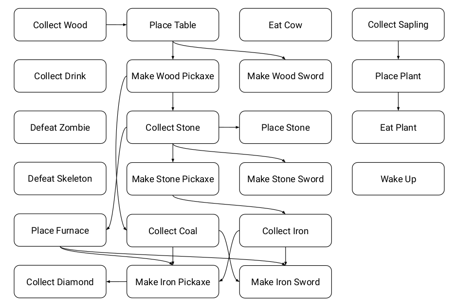

# Crafter Strategy within the OaK Framework

The major task in Crafter is **survival and reward maximization** through the exploration of its technology tree. Specifically, the agent is evaluated based on its **Crafter score**, which represents the geometric mean of success rates across 22 distinct achievements. This overarching goal requires the agent to balance resource collection and tool crafting while resisting the constant pressure of maintaining health, food, water, and rest levels in a procedurally generated world.

## Reward Structure

Crafter provides a sparse reward signal with two components:
- **Achievement Reward:** +1 every time the agent unlocks each achievement for the **first time** during the current episode
- **Health Reward:** −0.1 for every health point lost and +0.1 for every health point regenerated

The maximum health is 9 points, so the health component only affects the first decimal of the episode return. Ceiling the episode return yields the number of achievements unlocked during the episode.

## Subtasks Overview

**Subtasks** in Crafter are primarily identified as the **22 semantically meaningful achievements** that serve as behavioral milestones. These achievements cover a wide spectrum of abilities, including **foraging for food**, **collecting materials** (such as wood, stone, and coal), and **defeating creatures** like zombies or skeletons. 

Within the **OaK (Options and Knowledge) architecture**, these subtasks are formally defined as **reward-respecting subtasks of feature attainment**. This framework suggests that the agent autonomously poses auxiliary problems to reach specific state features—such as "attaining wood" or "finding a lake"—while still prioritizing the primary extrinsic reward signal. Solving these subtasks allows the agent to develop **options**, which are high-level policies that coordinate fine-grained actions into meaningful, temporally extended behaviors.

## Technology Tree Dependencies

Many subtasks are **hierarchically dependent**, forming a technology tree where complex achievements require the completion of numerous prerequisite tasks. The dependency graph is structured as follows:

### Prerequisite Table



Sub tasks:

| Subtask | Prerequisites | Notes |
|---------|---------------|-------|
| **Collect Wood** | None | Root task - enables all crafting |
| **Place Table** | Collect Wood | **Required for ALL tool crafting** |
| **Make Wood Pickaxe** | Collect Wood, Place Table | Enables stone collection |
| **Make Wood Sword** | Collect Wood, Place Table | Basic combat weapon |
| **Collect Stone** | Make Wood Pickaxe | Requires wood pickaxe to mine |
| **Make Stone Pickaxe** | Collect Stone, Place Table | Enables coal/iron collection |
| **Make Stone Sword** | Collect Stone, Place Table | Improved combat weapon |
| **Place Stone** | Collect Stone | Environmental modification |
| **Collect Coal** | Make Stone Pickaxe | **Required for furnace** |
| **Place Furnace** | Collect Coal, Collect Stone | **Required for iron-tier crafting** |
| **Collect Iron** | Make Stone Pickaxe, Place Furnace | Requires both pickaxe AND furnace |
| **Make Iron Pickaxe** | Collect Iron, Collect Coal, Collect Wood, Place Furnace | Enables diamond collection |
| **Make Iron Sword** | Collect Iron, Collect Coal, Collect Wood, Place Furnace | Best combat weapon |
| **Collect Diamond** | Make Iron Pickaxe | Terminal achievement in tech tree |
| **Collect Sapling** | None | Independent of main tech tree |
| **Place Plant** | Collect Sapling | Plants saplings for food source |

### Critical Dependency Chains

The longest dependency chain to **Collect Diamond**:
```
Collect Wood → Place Table → Make Wood Pickaxe → Collect Stone → Make Stone Pickaxe
                                                         ↓
Collect Coal → Place Furnace → Collect Iron → Make Iron Pickaxe → Collect Diamond
```

**Key insight:** Collecting iron has **two parallel prerequisites**:
1. `Make Stone Pickaxe` (to mine the iron ore)
2. `Place Furnace` (to smelt the iron)

This creates a critical junction where the agent must pursue both the coal→furnace path AND the stone pickaxe path.

## Survival Tasks (Parallel Constraints)

Unlike the technology tree achievements, survival tasks operate as **parallel constraints** that run continuously throughout the episode. These are not prerequisites for other tasks but must be satisfied to prevent episode termination:

| Survival Task | Trigger Condition | Effect |
|---------------|-------------------|--------|
| **Collect Drink** | Water level depleting | Restores water by drinking from lake |
| **Eat Cow** | Food level depleting | Restores hunger by hunting cows |
| **Eat Plant** | Food level depleting | Restores hunger by harvesting plants |
| **Defeat Zombie** | Zombie attack (especially at night) | Defensive action to prevent health loss |
| **Defeat Skeleton** | Skeleton attack (in caves) | Defensive action to prevent health loss |
| **Wake Up** | Rest level depleting | Sleep through night safely in shelter |

**OaK Implication:** These survival tasks represent **interrupt options** that the agent must execute when internal state features (health, food, water, rest) fall below critical thresholds. They compete with progression tasks for the agent's attention, creating a natural survival-vs-progression tradeoff that reward-respecting options handle by avoiding negative health outcomes during pursuit of other goals.

## Feature Attainment Definitions

In the context of OaK, sub-tasks are defined as **reward-respecting subtasks of feature attainment**, which require the agent to drive the world to a state where a specific feature is "high" or achieved while still maximizing the environment's extrinsic rewards.

### Resource Collection Sub-tasks
*   **Collect Wood, Stone, Coal, Iron, and Diamond**: Feature attainment involves navigating to these materials and adding them to the agent's **inventory**.
*   **Collect Sapling**: Attainment is achieved by successfully acquiring a sapling, which is a prerequisite for planting.
*   **Collect Drink**: Attainment occurs when the agent successfully **restores water levels** by drinking from a lake.

### Crafting and Equipment Sub-tasks
*   **Make Wood, Stone, and Iron Pickaxes**: Feature attainment is the creation of mining tools that are stored in the inventory, enabling the collection of advanced resources.
*   **Make Wood, Stone, and Iron Swords**: Attainment is the creation of defensive items used to **defeat creatures** more effectively.
*   **Place Table**: Attainment involves placing a crafting table in the environment, which is **required before crafting any pickaxe or sword**.
*   **Place Furnace**: Attainment occurs when a furnace is placed using collected stone and coal, enabling iron-tier equipment crafting.

### Environmental and Survival Sub-tasks
*   **Place Stone and Place Plant**: Attainment involves the agent **modifying the map** by placing blocks of stone or planting saplings.
*   **Eat Cow and Eat Plant**: Feature attainment is the consumption of food to **restore hunger and health levels**.
*   **Defeat Zombie and Defeat Skeleton**: Attainment is achieved by reducing a monster's health to zero.
*   **Wake Up**: Attainment involves successfully **sleeping through the night** and terminating the sleep state safely.

---

## OaK Framework: Reward-Respecting Subtasks of Feature Attainment

**Reward-respecting subtasks of feature attainment** are auxiliary problems an agent poses for itself to learn how to reach specific state features while still prioritizing the maximization of the environment's primary reward signal. This concept is a core component of the **OaK (Options and Knowledge)** architecture and is designed to bridge the gap between low-level signals and high-level reasoning.

### 1. Definition and Core Mechanism

A reward-respecting subtask is a subtask that **optimizes the rewards of the original task** until it terminates in a state that is assigned a high value. In the specific case of **feature attainment**, the goal is to drive the world to a state where a particular feature (e.g., "attaining wood" or "reaching a hallway") is "high" or achieved.

While a standard value function only predicts the expected sum of future rewards, a **General Value Function (GVF)** generalizes this idea to predict any signal or "cumulant" over arbitrary time scales. GVFs are the primary mechanism for **knowledge representation** in OaK.

### 2. The Four Components of a GVF

To define a GVF for a Crafter subtask, you must specify four key components:

| Component | Symbol | Definition | Crafter Implementation |
|-----------|--------|------------|------------------------|
| **Cumulant** | $C_t$ | The quantity the agent accumulates over time | Identical to environment reward: $C_t = R_t$ (ensures survival while pursuing sub-goals) |
| **Stopping Function** | $\beta(s)$ | Probability that accumulation stops at state $s$ | $\beta(s) = 1$ when target feature achieved (e.g., wood in inventory) |
| **Stopping Value** | $z(s)$ | Additional value added when subtask stops | Optimistic bonus for target feature (see equation below) |
| **Policy** | $\pi$ | The behavior to maximize expected cumulant + stopping value | Learned via TD methods to reach target feature safely |

### 3. Formal Definition: Stopping Value Equation

For a subtask $i$ targeting a specific feature $x_i$ (e.g., diamond in inventory), the stopping value is:

$$z_i(s) = w^\top x(s) - w_i x_i(s) + \bar{w}_i x_i(s)$$

Where:
- $w$ = weight vector for all features (learned from main task value function)
- $x(s)$ = feature vector at state $s$
- $w_i$ = standard weight for feature $i$
- $\bar{w}_i$ = **optimistic bonus weight** for feature $i$ (much larger than $w_i$)

This equation effectively **replaces the standard weight** of the target feature with a much higher "bonus" weight, creating a strong incentive to terminate in states where that feature is present.

**Example - Collect Diamond Subtask:**
```
z_diamond(s) = w^T x(s) - w_diamond * x_diamond(s) + w̄_diamond * x_diamond(s)
             = [standard value of state] + (w̄_diamond - w_diamond) * x_diamond(s)
```
When `x_diamond(s) = 1` (diamond collected), the agent receives a large bonus from $(w̄_{diamond} - w_{diamond})$.

### 4. Termination Conditions for Crafter Options

Each option in OaK has a termination condition $\beta(s)$ that determines when the option completes. For Crafter subtasks:

| Option | Termination Condition $\beta(s) = 1$ when... |
|--------|---------------------------------------------|
| **Collect Wood** | `inventory.wood > previous_inventory.wood` |
| **Collect Stone** | `inventory.stone > previous_inventory.stone` |
| **Collect Coal** | `inventory.coal > previous_inventory.coal` |
| **Collect Iron** | `inventory.iron > previous_inventory.iron` |
| **Collect Diamond** | `inventory.diamond > previous_inventory.diamond` |
| **Place Table** | Table object placed on grid (detected via semantic grid) |
| **Place Furnace** | Furnace object placed on grid |
| **Make Wood Pickaxe** | `inventory.wood_pickaxe == True` |
| **Make Stone Pickaxe** | `inventory.stone_pickaxe == True` |
| **Make Iron Pickaxe** | `inventory.iron_pickaxe == True` |
| **Collect Drink** | `water_level > previous_water_level` |
| **Eat Cow/Eat Plant** | `food_level > previous_food_level` |
| **Wake Up** | `rest_level > previous_rest_level` AND not sleeping |
| **Defeat Zombie/Skeleton** | Target creature health reaches 0 |

### 5. Distinction from Traditional Subtasks

Unlike traditional "shortest-path" subtasks that might ignore rewards to reach a goal quickly, reward-respecting subtasks ensure the agent **avoids negative outcomes** during the pursuit.

*   **Example:** In a gridworld with a field of negative rewards, a shortest-path option might lead an agent through the field to reach a goal. A **reward-respecting option** would instead learn a roundabout path that avoids the penalties while still reaching the goal.

**Crafter Application:** When pursuing "Collect Diamond," a reward-respecting option will:
- Avoid zombies and skeletons (to prevent health loss penalty of -0.1 per HP)
- Maintain food/water levels (to prevent health degradation)
- Take the safest path rather than the shortest path

### 6. Role of GVFs in Planning

Within the **STOMP (SubTask, Option, Model, Planning) progression**, these subtasks serve several critical functions:
*   **Constraining Option Space:** Instead of an infinite space of possible behaviors, the agent focuses on attaining its most important state features.
*   **Generating Useful Models:** Option models learned from these subtasks are much more likely to be useful in planning because the behaviors they represent are already aligned with the agent's overall objective of reward maximization.
*   **Ranking Features:** In the OaK architecture, an agent can automatically rank its millions of state features by their connection to the main reward and prioritize creating subtasks for those that contribute most to its value function.

### 7. Learning Process

By learning to solve these GVFs, the agent discovers **options** (policies and termination conditions) and builds **transition models**. These models allow the agent to plan at a higher level of temporal abstraction—planning in terms of "collecting wood" or "crafting a table" rather than individual pixel-level actions—which is essential for solving Crafter's complex technology tree.

The agent uses a general update procedure called **UWT (UpdateWeights&Traces)** and temporal-difference (TD) errors to learn these values off-policy from experience. Ultimately, this creates a **virtuous cycle** where new features lead to new subtasks, which in turn lead to higher levels of abstraction and reasoning.

---

## Feature Representation for Crafter

The state feature vector $x(s)$ in Crafter can be constructed from:

### Binary Achievement Features (22 features)
Each achievement maps to a binary feature indicating if it has been unlocked in the current episode:
```
x_achievement[i] = 1 if achievement_i unlocked else 0
```

### Inventory Count Features
Continuous features representing resource quantities:
```
x_wood, x_stone, x_coal, x_iron, x_diamond, x_sapling ∈ ℕ
```

### Tool Possession Features (Binary)
```
x_wood_pickaxe, x_stone_pickaxe, x_iron_pickaxe ∈ {0, 1}
x_wood_sword, x_stone_sword, x_iron_sword ∈ {0, 1}
```

### Vital Status Features (Continuous, normalized to [0,1])
```
x_health, x_food, x_water, x_rest ∈ [0, 1]
```

### Placed Object Features (Binary)
```
x_table_placed, x_furnace_placed ∈ {0, 1}
```

---

## Survival vs. Progression Tradeoff

A key challenge in Crafter is balancing **immediate survival** against **long-term progression**. OaK's reward-respecting options naturally handle this because:

1. **Health penalties are immediate:** Losing health incurs -0.1 reward, which the GVF cumulant captures directly.

2. **Survival options have high interrupt priority:** When vital levels (food, water, rest) approach zero, the stopping value $z_i(s)$ for survival options increases dramatically because the agent anticipates future health loss.

3. **Progression options remain reward-respecting:** Even when pursuing diamonds, the option policy avoids actions that would trigger health loss, causing the agent to detour for food/water when necessary.

**Emergent Behavior:** This explains the sophisticated behaviors observed in trained DreamerV2 agents (50M steps):
- Building shelters to sleep safely (avoiding zombie damage at night)
- Creating plantations for reliable food supply
- Building tunnel systems to navigate safely

---

## Unresolved Issues (Unclear to me need to study more!)

The following aspects require additional information from the OaK framework literature:

1. **Optimistic Bonus Weight Selection:** How to determine the optimal value of $\bar{w}_i$ for each feature attainment subtask. The trade-off between exploration (high bonus) and exploitation (low bonus) is domain-dependent.

2. **Feature Ranking Algorithm:** The specific algorithm used to rank features by their contribution to the value function and decide which features warrant dedicated subtasks.

3. **Option Composition:** How lower-level options (e.g., "Collect Wood") compose into higher-level options (e.g., "Make Iron Pickaxe") within the STOMP hierarchy.

4. **UWT Update Details:** Specific hyperparameters and eligibility trace mechanisms for the UpdateWeights&Traces procedure in Crafter's high-dimensional observation space.

5. **Off-Policy Correction:** How the agent corrects for the behavioral policy when learning multiple option policies simultaneously from the same experience stream.

6. **Automated Discovery of Sub-tasks:** The current implementation manually defines all 22 subtasks with hand-crafted termination conditions and target states. How should the agent autonomously discover meaningful subtasks, identify which state features are worth pursuing, and automatically derive appropriate termination conditions? The OaK framework suggests feature ranking can guide this, but the specific mechanisms for automated subtask discovery and termination condition synthesis remain unclear.
